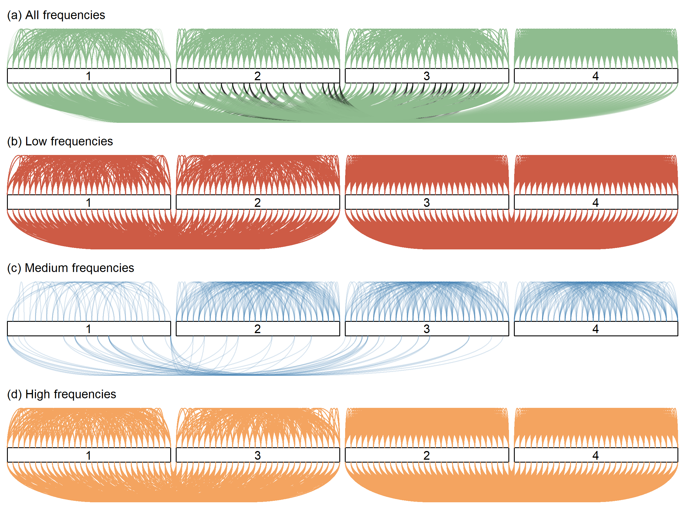

# Bayesian Projection Clustering

This repository contains supporting code and data for the following manuscript:

&nbsp;&nbsp; Mao, Y., Nott, D.J., Kim, M., Han, D., and Choi, T. (2024) "Bayesian clustering using random effects models and predictive projections."

### Authors

Yinan Mao, National University of Singapore (maoyinan.jscz@gmail.com)<br/>
David. J. Nott, National University of Singapore (standj@nus.edu.sg)<br/>
Minhyeok Kim, Korea University (kmh15937@korea.ac.kr)<br/>
Dongu Han, Korea University (idontknow35@korea.ac.kr)<br/>
Taeryon Choi, Korea University (trchoi@korea.ac.kr)<br/>

### Maintainers

Yinan Mao, National University of Singapore (maoyinan.jscz@gmail.com)<br/>
Minhyeok Kim, Korea University (kmh15937@korea.ac.kr)<br/>
Dongu Han, Korea University (idontknow35@korea.ac.kr)<br/>

## Introduction

We propose a Bayesian clustering method that combines linear mixed models with predictive projections. Our approach generates a predictive replicate for each observation, sharing only a selected subset of random effects with the original, while the remaining effects are integrated out via the conditional prior. Predictive projections are then defined in which the number of distinct values for the shared random effects is finite, in order to obtain different clusters. The main advantage of our method is the ability to control which aspects of the data define clusters through the choice of random effects that are shared with the predictive replicates.

## Example with synthetic data

We generate a synthetic longitudinal data as described in Section 4.1 of the paper. For the $`i`$th subject at time $`t`$, the responses are generated as:
```math
y_{it} = \beta^{(1)}_{\delta_i} \cos(\pi w^{(1)}_i t) +  \beta^{(2)}_{\delta_i} \cos(\pi w^{(2)}_i t) + \epsilon_{it},
```
for $i = 1, 2, \ldots, 120$ and $t = 1/40, 2/40, \ldots, 39/40, 1$.

- $`w^{(1)}_i \sim \text{Unif}(\{1,2,3\})`$, $`w^{(2)}_i \sim \text{Unif}(\{7,8,9\})`$, and $`\epsilon_{it}\sim N(0,0.1)`$.
- Assign $`\delta_i=g`$ if subject $`i`$ belongs to group $`g\in \{1,2,3,4\}`$. The groups are defined as follows:

```math
(\beta^{(1)}_g, \beta^{(2)}_g) = 
\begin{cases}
	(1,1), &\mbox{if } g= 1, \\ 
	(1,0.1), & \mbox{if } g =2,\\
	(0.1,1), & \mbox{if } g =3,\\
	(0.1,0.1), & \mbox{if } g =4.
\end{cases}
```

For each individual, one basis function is a 'low frequency' term and one basis function is a 'high frequency' term. The coefficient for each basis function can be large or small in magnitude, so that the low or high frequency signal can be strong or weak.

<p align="center">
  
</p>

We fit temporal trends in the data using Fourier cosine bases, incorporating a random effect for each basis function. Next, we apply our clustering method with four different choices of random effects corresponding to the following frequency ranges: (1) all frequencies, (2) low frequencies, (3) intermediate frequencies, and (4) high frequencies.

### Results

<p align="center">
  
</p>

## Application to real datasets

We analyze two datasets in the paper: crop image data (Section 4.2) and DNA data (Section 4.3).
- Following the synthetic example, we use a mixed effects model with Fourier cosine bases as the random effects. We then apply our clustering method using four different choices of random effects, each based on frequency ranges tailored to the specific dataset. 
- For each clustering, the number of clusters is chosen based on clustering stability estimated by nonparametric bootstrap.
- We consider 5 classes, each containing 30 observed series, totaling 150 time series from 5 distinct classes.

### Crop image data

- The data can be downloaded from the [UCR Time Series Classification Archive](https://www.cs.ucr.edu/%7Eeamonn/time_series_data_2018/).
- Each observation represents a time series associated with a pixel from a satellite image, where the images at different times are corrected so that a given pixel corresponds to the same spatial region in all images.

<p align="center">
  
</p>

### Results

<p align="center">
  
</p>

<p align="center">
  
</p>


### DNA data

- In the gene expression data (DNA data), each time series gives gene expression level over time relative to a control sample in yeast cells of 5 stages. Each series contains 18 records measured 7 minutes apart.

<p align="center">
  
</p>

### Results

<p align="center">
  
</p>

<p align="center">
  
</p>
